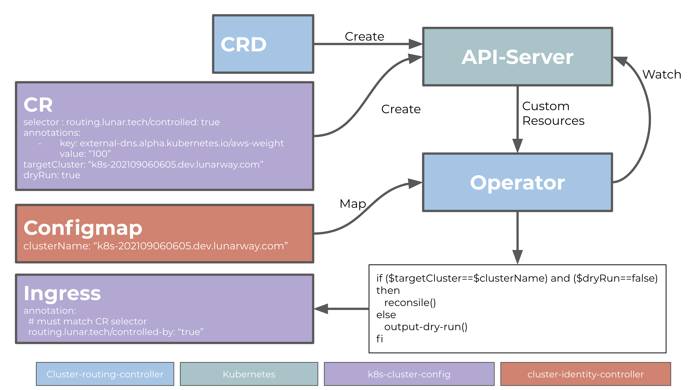

# cluster-routing-controller
A k8s operator to manage external DNS routing

## Short introduction
This operator is made to control ingress annotations across the cluster.

I needs to know the identity of the cluster its running in. This is done through an environment variable that is loaded via a `configmap`. Each `custom resource` then defines which cluster it belongs to, so only controllers running in that cluster will apply the annotations.

The annotations are put on Ingress objects that has the opt-in annotation `routing.lunar.tech/controlled: true`. The annotations this operator puts on an Ingress is then used by `ExternalDNS` set setup loadbalancer weights.

## Overview of the moving parts

**The blue parts** are those provided by this operator, namly the `CRD` definition and the operator itself. This is the core components.

**The purple parts** are defined by outside yaml. One being one or many `Custom Resource` defining new annotations that should be put on Ingress objects. The Ingress should have a opt-in annotation for the operator to apply changes to it. Otherwise it will not do anything to the specific Ingress.

**The green parts** are part of Kubernetes, the Api-server.

**The red part** is either controller by outside yaml or another operator that knows this clusters identity. It could be [Cluster Identity Controller](https://github.com/lunarway/cluster-identity-controller). The configmap should have a field witht the name of the given cluster.

